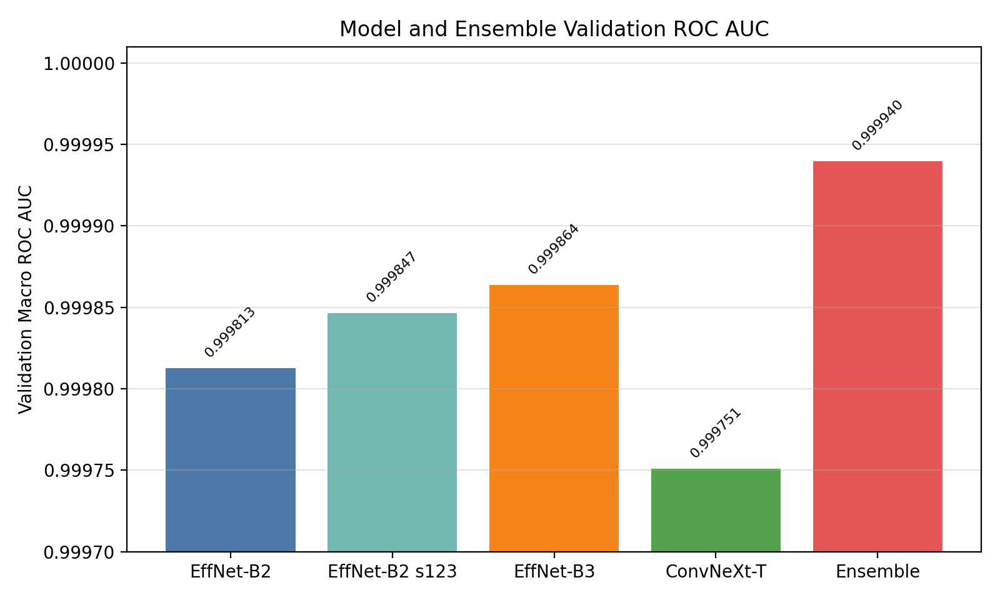
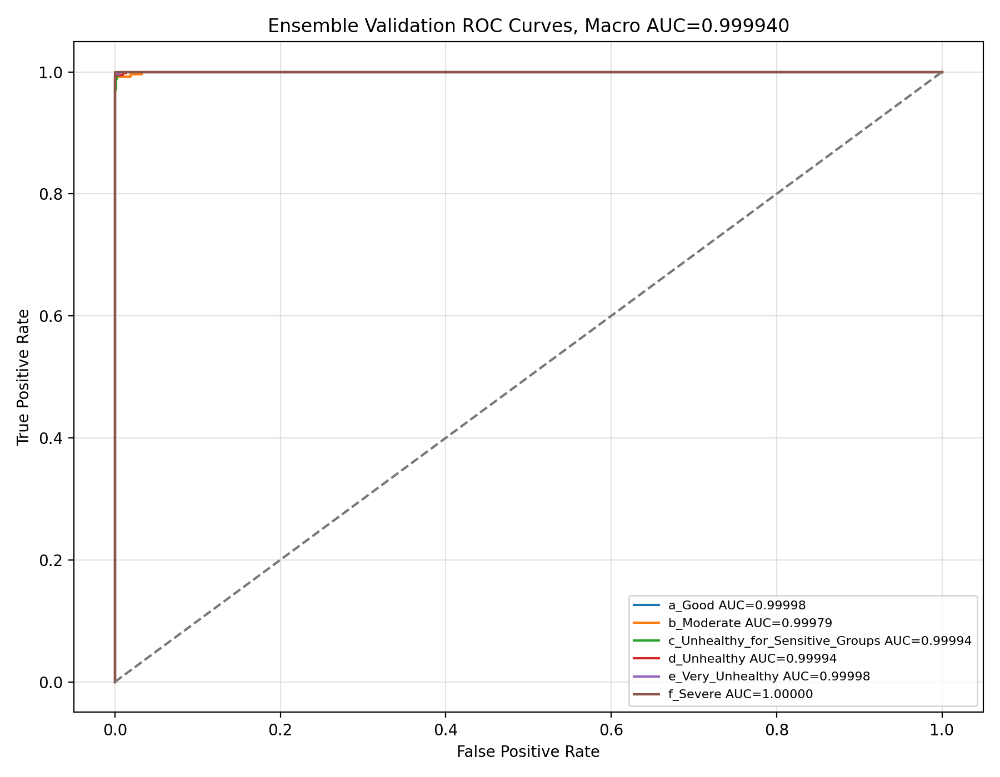
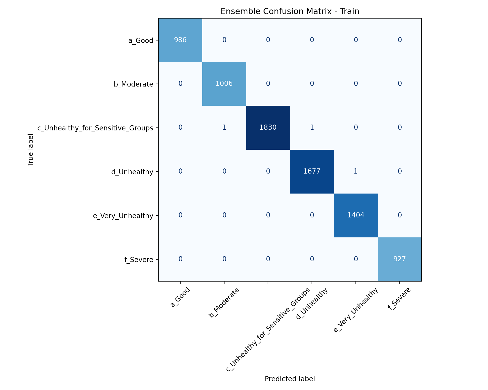

# India and Nepal AQI Image Classification Final Report

課程：Introduction to Deep Learning 2026 Final Exam  
競賽：2026 DL Final Exam - India & Nepal AQI Classification  
Kaggle account：[`kageryo`](https://www.kaggle.com/kageryo)  
報告日期：2026-06-06  

## 1. Executive Summary

本專案完成六類 AQI 影像分類模型，預測欄位完全遵守 Kaggle `sample_submission.csv` 格式：

`Filename`, `a_Good`, `b_Moderate`, `c_Unhealthy_for_Sensitive_Groups`, `d_Unhealthy`, `e_Very_Unhealthy`, `f_Severe`

最終提交檔案為：

`outputs/ensemble_refit_b2_b3_convnext/submission.csv`

最終模型採用 EfficientNet-B2、EfficientNet-B2 seed 123、EfficientNet-B3、ConvNeXt Tiny 的固定權重 ensemble。權重先在公開 validation split 上選定，再將各 checkpoint 以公開 `train_data.csv` + `val_data.csv` 進行低 learning-rate refit，最後用同一組固定權重產生測試集機率。

| Item | Result |
|---|---:|
| Validation ensemble macro ROC AUC | 0.9999395432 |
| Validation ensemble accuracy | 0.9923430322 |
| Validation ensemble macro F1 | 0.9930450064 |
| Kaggle Public ROC AUC | 1.00000 |
| Kaggle Private ROC AUC | Not released yet |

Hidden test labels were not used. `test_data.csv` contains filenames only, and the project code rejects `test_data.csv` if `AQI_Class` is present.

## 2. Dataset and Data Usage

Only public files from the Kaggle competition were used:

- `data/train_data.csv`
- `data/val_data.csv`
- `data/test_data.csv`
- `data/sample_submission.csv`
- `data/images/`

`train_data.csv` and `val_data.csv` include AQI class labels and pollutant columns. `test_data.csv` includes only `Filename`, so test-set labels, hidden metrics, external metadata, directory names, and filename abbreviation reconstruction were not used.

### Dataset Split

| Split | Rows | Label availability |
|---|---:|---|
| Train | 7,833 | AQI class + pollutant values |
| Validation | 1,959 | AQI class + pollutant values |
| Test | 2,448 | Filename only |

### Class Distribution

| Class | Train | Validation |
|---|---:|---:|
| `a_Good` | 986 | 247 |
| `b_Moderate` | 1,006 | 252 |
| `c_Unhealthy_for_Sensitive_Groups` | 1,832 | 458 |
| `d_Unhealthy` | 1,678 | 420 |
| `e_Very_Unhealthy` | 1,404 | 351 |
| `f_Severe` | 927 | 231 |

## 3. Method

### Classification Models

The final submission uses a validation-selected ensemble of four ImageNet-pretrained CNN/backbone models:

| Model | Input size | Notes |
|---|---:|---|
| EfficientNet-B2 | 288 | Main high-performing EfficientNet run |
| EfficientNet-B2 seed 123 | 288 | Same architecture with different random seed |
| EfficientNet-B3 | 300 | Larger EfficientNet for diversity |
| ConvNeXt Tiny | 224 | Different architecture family for ensemble diversity |

Training used:

- PyTorch and torchvision pretrained weights
- Random resized crop, horizontal flip, small rotation, and color jitter for training augmentation
- ImageNet normalization
- Class-balanced cross entropy
- Label smoothing = 0.05
- AdamW optimizer
- Separate learning rates for backbone and classifier
- Cosine annealing learning-rate schedule
- Mixed precision when CUDA is available
- DDP support for the two local RTX 4090 GPUs
- Horizontal-flip test-time augmentation for final prediction runs

### Ensemble and Refit Strategy

The selected validation ensemble used these fixed weights:

| Component | Weight |
|---|---:|
| EfficientNet-B2 refit | 0.06 |
| EfficientNet-B2 seed 123 refit | 0.39 |
| EfficientNet-B3 refit | 0.05 |
| ConvNeXt Tiny refit | 0.50 |

The weights were selected only from validation predictions before the final refit. After model selection, each component was refit for 3 epochs on all public labeled data (`train_data.csv` + `val_data.csv`) with low learning rates, then blended with the same fixed weights to create the final Kaggle submission.

## 4. Results

### Model Comparison



| Model | Train Acc. | Train Macro ROC AUC | Val Acc. | Val Macro F1 | Val Macro ROC AUC | Val MAE | Val RMSE |
|---|---:|---:|---:|---:|---:|---:|---:|
| EfficientNet-B2 | 0.999234 | 0.999998 | 0.991833 | 0.992199 | 0.999813 | 0.011230 | 0.135561 |
| EfficientNet-B2 seed 123 | 0.998085 | 0.999998 | 0.990301 | 0.990791 | 0.999847 | 0.013272 | 0.153236 |
| EfficientNet-B3 | 0.997702 | 0.999995 | 0.988259 | 0.989282 | 0.999864 | 0.014803 | 0.144669 |
| ConvNeXt Tiny | 0.999234 | 1.000000 | 0.992853 | 0.993114 | 0.999751 | 0.012762 | 0.161350 |
| Validation-selected ensemble | 0.999617 | 1.000000 | 0.992343 | 0.993045 | 0.999940 | 0.010209 | 0.123749 |

The ensemble improves macro ROC AUC over each individual model on the validation split. ConvNeXt Tiny has the highest validation accuracy among single models, while the ensemble gives the best validation macro ROC AUC, which matches the Kaggle evaluation objective.

### Per-Class Validation ROC AUC

| Class | EfficientNet-B2 | EfficientNet-B2 seed 123 | EfficientNet-B3 | ConvNeXt Tiny | Ensemble |
|---|---:|---:|---:|---:|---:|
| `a_Good` | 0.999950 | 0.999858 | 0.999988 | 0.999981 | 0.999981 |
| `b_Moderate` | 0.999233 | 0.999705 | 0.999726 | 0.998687 | 0.999791 |
| `c_Unhealthy_for_Sensitive_Groups` | 0.999830 | 0.999703 | 0.999708 | 0.999919 | 0.999940 |
| `d_Unhealthy` | 0.999865 | 0.999836 | 0.999833 | 0.999943 | 0.999943 |
| `e_Very_Unhealthy` | 0.999998 | 0.999977 | 0.999933 | 0.999977 | 0.999982 |
| `f_Severe` | 1.000000 | 1.000000 | 0.999995 | 1.000000 | 1.000000 |

### Ensemble Validation ROC Curves



### Kaggle Result

| Score type | ROC AUC |
|---|---:|
| Public leaderboard | 1.00000 |
| Private leaderboard | Not released yet |

Because the hidden private labels are not available before competition close, this report does not include a private score or test confusion matrix.

## 5. Confusion Matrices

Class order in all matrices:

1. `a_Good`
2. `b_Moderate`
3. `c_Unhealthy_for_Sensitive_Groups`
4. `d_Unhealthy`
5. `e_Very_Unhealthy`
6. `f_Severe`

### Train Confusion Matrix



Numeric matrix:

| True \ Pred | a_Good | b_Moderate | c_USG | d_Unhealthy | e_Very_Unhealthy | f_Severe |
|---|---:|---:|---:|---:|---:|---:|
| a_Good | 986 | 0 | 0 | 0 | 0 | 0 |
| b_Moderate | 0 | 1006 | 0 | 0 | 0 | 0 |
| c_USG | 0 | 1 | 1830 | 1 | 0 | 0 |
| d_Unhealthy | 0 | 0 | 0 | 1677 | 1 | 0 |
| e_Very_Unhealthy | 0 | 0 | 0 | 0 | 1404 | 0 |
| f_Severe | 0 | 0 | 0 | 0 | 0 | 927 |

### Validation Confusion Matrix


Numeric matrix:

| True \ Pred | a_Good | b_Moderate | c_USG | d_Unhealthy | e_Very_Unhealthy | f_Severe |
|---|---:|---:|---:|---:|---:|---:|
| a_Good | 246 | 0 | 1 | 0 | 0 | 0 |
| b_Moderate | 1 | 249 | 1 | 1 | 0 | 0 |
| c_USG | 1 | 2 | 450 | 3 | 2 | 0 |
| d_Unhealthy | 0 | 0 | 2 | 418 | 0 | 0 |
| e_Very_Unhealthy | 0 | 0 | 0 | 1 | 350 | 0 |
| f_Severe | 0 | 0 | 0 | 0 | 0 | 231 |

Most validation errors are between adjacent or visually similar AQI categories, especially the middle AQI classes. The severe class is perfectly separated on the validation split.

## 6. Submission Validation

The final submission file was checked against the required Kaggle format:

| Check | Result |
|---|---|
| File | `outputs/ensemble_refit_b2_b3_convnext/submission.csv` |
| Rows | 2,448 |
| Columns | `Filename` + six class probability columns |
| Column order | Matches `sample_submission.csv` |
| Test labels used | No |
| Probability row sums | Min 0.9999998964, max 1.0000000953 |
| Probability range | 0.0004843999 to 0.9951294661 |

The same CSV should be uploaded to Kaggle and eCourse2 to satisfy the final exam requirement that both submitted CSV files are exactly the same.

## 7. Optional Bonus Regression

A separate ConvNeXt multi-task model was trained for optional pollutant prediction. It uses the classification checkpoint as initialization and adds regression heads for:

`AQI`, `PM2.5`, `PM10`, `O3`, `CO`, `SO2`, `NO2`

The Kaggle classification CSV is unchanged; bonus predictions are written separately:

- `outputs/bonus_multitask_mask/bonus_aqi_pm25.csv`
- `outputs/bonus_multitask_mask/bonus_all_metrics.csv`

Validation regression metrics:

| Target | MAE | RMSE |
|---|---:|---:|
| AQI | 5.950248 | 10.770604 |
| PM2.5 | 8.840734 | 18.436533 |
| PM10 | 7.917593 | 17.568477 |
| O3 | 2.525608 | 4.971466 |
| CO | 11.826833 | 25.120893 |
| SO2 | 0.811326 | 1.538283 |
| NO2 | 3.220580 | 7.993839 |

## 8. Reproducibility

Install the project:

```bash
conda activate dl-class-ryo
python -m pip install -e .
```

Download and validate public competition files:

```bash
python download_data.py
```

Example full dual-GPU training commands:

```bash
torchrun --standalone --nproc_per_node=2 main.py \
  --data-dir data \
  --output-dir outputs/efficientnet_b2 \
  --model-dir models/efficientnet_b2 \
  --model-name efficientnet_b2 \
  --epochs 30 \
  --batch-size 48 \
  --tta
```

```bash
torchrun --standalone --nproc_per_node=2 main.py \
  --data-dir data \
  --output-dir outputs/convnext_tiny \
  --model-dir models/convnext_tiny \
  --model-name convnext_tiny \
  --epochs 30 \
  --batch-size 32 \
  --tta
```

Final fixed-weight refit blend:

```bash
python blend_fixed.py \
  --output-dirs \
    outputs/efficientnet_b2_refit \
    outputs/efficientnet_b2_seed_123_refit \
    outputs/efficientnet_b3_refit \
    outputs/convnext_tiny_refit \
  --weights 6 39 5 50 \
  --output-dir outputs/ensemble_refit_b2_b3_convnext
```

Run checks:

```bash
python -m py_compile main.py download_data.py
python -m pytest
```

## 9. Files for Submission

Recommended eCourse2 package contents:

| Requirement | Project file/path |
|---|---|
| Kaggle account name | `kageryo`, https://www.kaggle.com/kageryo |
| Final report | `reports/final_report.md` |
| Test results CSV | `outputs/ensemble_refit_b2_b3_convnext/submission.csv` |
| Final trained model | `models/*_refit/final_model.pt` and/or selected component checkpoints |
| Source code | `main.py`, `refit.py`, `blend_fixed.py`, `ensemble.py`, `ensemble_three.py`, `bonus_multitask.py`, `download_data.py` |
| Bonus CSVs | `outputs/bonus_multitask_mask/bonus_aqi_pm25.csv`, `outputs/bonus_multitask_mask/bonus_all_metrics.csv` |

## 10. References

- Kaggle competition: https://www.kaggle.com/competitions/2026-dl-final-exam-india-nepal-aqi-classification
- Dataset provenance: https://github.com/ICCC-Platform/Air-Pollution-Image-Dataset-From-India-and-Nepal
- Kaggle account used for submission: https://www.kaggle.com/kageryo
